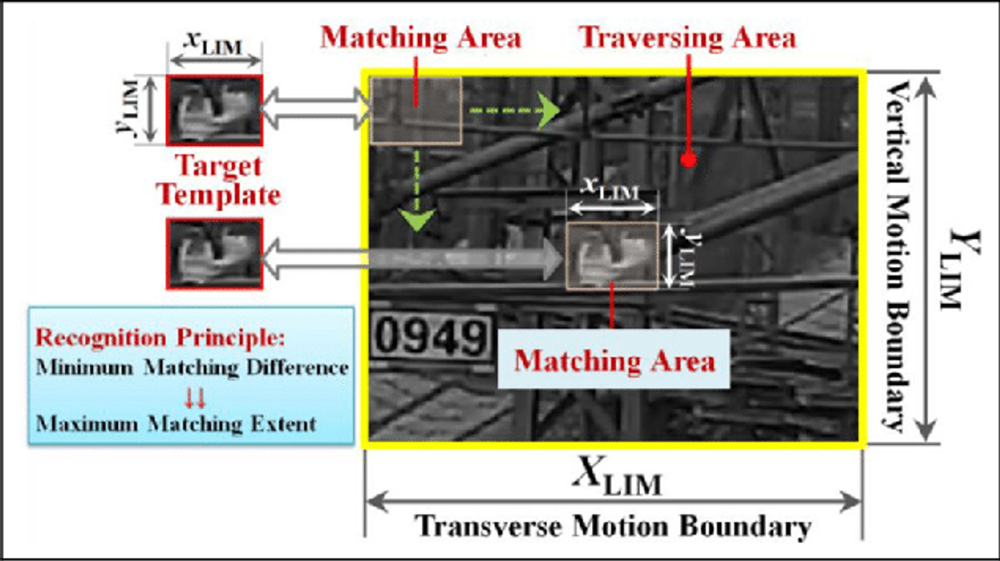
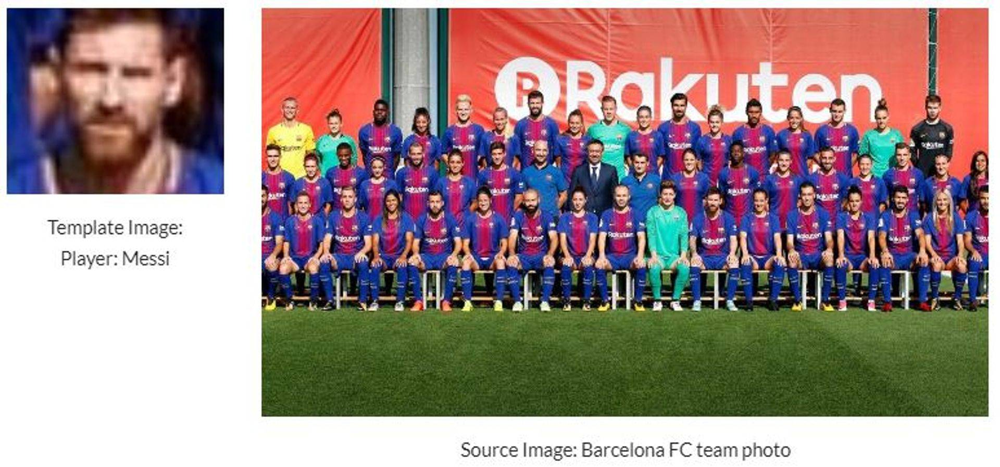

# Object Detection & Recognition using Template Matching in OpenCV-Python

<div class="row">
  <div class="column">
    
  </div>
</div>

## 1. Objective

The objective of this project is to demonstrate object localization via template matching using OpenCV-Python built-in functionalities. 

## 2. Template Matching

Template matching is a technique for finding areas of an image that are similar to the template of an object of interest, such as a person, vehicle, animal, etc. The goal of template matching is to detect and localize the template image (T) in a source image S:

* The source Image (S), which is the image where the template may be localized
* The template Image (T), which is the image that is to be found in the source image.

Template matching is useful when the shape, orientation and scale of the object of interest in the new imaged scene rains almost the same as what is captured in its template image. Most fixed-template matching approach are based on computing a cross-similarity metric between the template and target images and detecting any peaks in the metric values. In particular, template matching apply a sliding window over all the pixels in the source image order to detect the position of cross-similarity metric peak value between a template and template-size patches of target image, at each of its pixels, and locate the best match, if the template image is present in the target image. The absence of such a significant peak indicates that the template image is likely not present in the target image.

### 2.1 Methodology

The applied template matching process can be outlined as follows:

* The template image simply slides over the input image (as in 2D convolution) 
* The template and patch of input image under the template image are compared.
* The result obtained is compared with the threshold
* If the result is greater than threshold, the portion will be marked as detected.

### 2.2 OpenCV Python API

The OpenCV Python API for the template matching functionality is as follows:
```
result=cv.matchTemplate(image, templ, method[, result[, mask]]) 
```

The Parameters are as follows:

1. Input:

* image: Image where the search is running. 
* template: Searched template. It must be not greater than the source image and have the same data type.
* result: Map of comparison results. If image is W×H  and template is w×h then result is (W−w+1)×(H−h+1)
* method: Parameter specifying the comparison method
  * The cross-similarity between the template and source image patch can be assessed based in several suitable metrics, which can be grouped as follows:
    * Mean squared error with or without normalization 
    * Cross correlation with or without normalization
  * OpenCV offers the six matching metrics, please see TemplateMatchModes for more information.
* mask: Optional mask. It must have the same size as template. 


2. Output:

* result: Map of comparison results. It must be single-channel 32-bit floating-point. If image is W×H  and template is w×h, then result is (W−w+1)×(H−h+1)

## 3. Data

The template and source images used to demonstrate the template matching development process are illustrated next.



## 4. Development

In this section, we shall outline the steps involved in the developing and illustrating the template matching application using OpenCV with Python API. 

* Author: Mohsen Ghazel (mghazel)
* Date: March 29th, 2021
* Project: Object Recognition via Template Matching:

* The objective of this project is to demonstrate object localization via template matching using OpenCV-Python built-in functionalities:

  * Template matching is a pixel-based technique for detecting and recognizing a template image of an object of interest within a newly acquired sources image, that may or may not contain the template image.
  * We shall develop the template matching process and illustrate intermediate and final results.

### 4.1. Step 1: Imports and global variables


<pre style="color:#000000;background:#e6ffff;font-size:10px;line-height:1.5;"><span style="color:#696969; ">#======================================================</span>
<span style="color:#696969; "># Python imports and environment setup</span>
<span style="color:#696969; ">#======================================================</span>
<span style="color:#696969; "># opencv</span>
<span style="color:#800000; font-weight:bold; ">import</span> cv2
<span style="color:#696969; "># numpy</span>
<span style="color:#800000; font-weight:bold; ">import</span> numpy <span style="color:#800000; font-weight:bold; ">as</span> np
<span style="color:#696969; "># matplotlib</span>
<span style="color:#800000; font-weight:bold; ">import</span> matplotlib<span style="color:#808030; ">.</span>pyplot <span style="color:#800000; font-weight:bold; ">as</span> plt
<span style="color:#800000; font-weight:bold; ">import</span> matplotlib<span style="color:#808030; ">.</span>image <span style="color:#800000; font-weight:bold; ">as</span> mpimg
<span style="color:#696969; "># input/output OS</span>
<span style="color:#800000; font-weight:bold; ">import</span> os 
<span style="color:#696969; "># Use %matplotlib notebook to get zoom-able &amp; resize-able notebook. </span>
<span style="color:#696969; "># - This is the best for quick tests where you need to work interactively.</span>
<span style="color:#44aadd; ">%</span>matplotlib notebook


<span style="color:#696969; ">#======================================================</span>
<span style="color:#696969; "># Global variales</span>
<span style="color:#696969; ">#======================================================</span>
<span style="color:#696969; "># Threshold for the normalized correlation </span>
<span style="color:#696969; "># coefficient similarity metric used by the template </span>
<span style="color:#696969; "># matching method: # - cv2.TM_CCOEFF_NORMED</span>
<span style="color:#696969; ">#------------------------------------------------------</span>
<span style="color:#696969; "># - values greater thain this threshold are considered </span>
<span style="color:#696969; ">#   a positive template matching.</span>
<span style="color:#696969; ">#------------------------------------------------------</span>
<span style="color:#696969; "># seta  high-confidence threshold</span>
CCOEFF_NORMED_THRESHOLD <span style="color:#808030; ">=</span> <span style="color:#008000; ">0.99</span>

<span style="color:#696969; ">#======================================================</span>
<span style="color:#696969; "># Test imports and display package versions</span>
<span style="color:#696969; ">#======================================================</span>
<span style="color:#696969; "># Testing the OpenCV version</span>
<span style="color:#800000; font-weight:bold; ">print</span><span style="color:#808030; ">(</span><span style="color:#0000e6; ">"OpenCV : "</span><span style="color:#808030; ">,</span>cv2<span style="color:#808030; ">.</span>__version__<span style="color:#808030; ">)</span>
<span style="color:#696969; "># Testinng the numpy version</span>
<span style="color:#800000; font-weight:bold; ">print</span><span style="color:#808030; ">(</span><span style="color:#0000e6; ">"Numpy : "</span><span style="color:#808030; ">,</span>np<span style="color:#808030; ">.</span>__version__<span style="color:#808030; ">)</span>


OpenCV <span style="color:#808030; ">:</span>  <span style="color:#008000; ">3.4</span><span style="color:#808030; ">.</span><span style="color:#008c00; ">8</span>
Numpy <span style="color:#808030; ">:</span>  <span style="color:#008000; ">1.19</span><span style="color:#808030; ">.</span><span style="color:#008c00; ">2</span>
</pre>

### 4.2. Step 2: Read and visualize the input images

Next, we read and visualize the input data, consisting of the template and source images, as discussed above.

#### 4.2.1. Read and visualize the input template image


<pre style="color:#000000;background:#e6ffff;font-size:10px;line-height:1.5;"><span style="color:#696969; ">#----------------------------------------------------</span>
<span style="color:#696969; "># Read the template image:</span>
<span style="color:#696969; ">#----------------------------------------------------</span>
<span style="color:#696969; "># template image file name</span>
template_img_file_path <span style="color:#808030; ">=</span> <span style="color:#0000e6; ">"../data/barcelona-team/messi.jpg"</span>
<span style="color:#696969; "># check if the template image file exists</span>
<span style="color:#800000; font-weight:bold; ">if</span><span style="color:#808030; ">(</span>os<span style="color:#808030; ">.</span>path<span style="color:#808030; ">.</span>exists<span style="color:#808030; ">(</span>template_img_file_path<span style="color:#808030; ">)</span> <span style="color:#44aadd; ">==</span> <span style="color:#008c00; ">0</span><span style="color:#808030; ">)</span><span style="color:#808030; ">:</span>
    <span style="color:#800000; font-weight:bold; ">print</span><span style="color:#808030; ">(</span><span style="color:#0000e6; ">'Template image file name DOES NOT EXIST! = '</span> <span style="color:#44aadd; ">+</span> template_img_file_path<span style="color:#808030; ">)</span>
<span style="color:#696969; "># Read the template of the image of the target image</span>
template_img <span style="color:#808030; ">=</span> cv2<span style="color:#808030; ">.</span>imread<span style="color:#808030; ">(</span>template_img_file_path<span style="color:#808030; ">,</span> cv2<span style="color:#808030; ">.</span>IMREAD_COLOR<span style="color:#808030; ">)</span>
<span style="color:#696969; "># create a figure and set its axis</span>
fig_size <span style="color:#808030; ">=</span> <span style="color:#808030; ">(</span><span style="color:#008c00; ">3</span><span style="color:#808030; ">,</span> <span style="color:#008c00; ">2</span><span style="color:#808030; ">)</span>
<span style="color:#696969; "># create the figure </span>
plt<span style="color:#808030; ">.</span>figure<span style="color:#808030; ">(</span>figsize<span style="color:#808030; ">=</span>fig_size<span style="color:#808030; ">)</span>
<span style="color:#696969; "># axis off</span>
plt<span style="color:#808030; ">.</span>axis<span style="color:#808030; ">(</span><span style="color:#0000e6; ">'off'</span><span style="color:#808030; ">)</span>
<span style="color:#696969; "># display the template image</span>
plt<span style="color:#808030; ">.</span>imshow<span style="color:#808030; ">(</span>cv2<span style="color:#808030; ">.</span>cvtColor<span style="color:#808030; ">(</span>template_img<span style="color:#808030; ">,</span> cv2<span style="color:#808030; ">.</span>COLOR_BGR2RGB<span style="color:#808030; ">)</span><span style="color:#808030; ">)</span>
<span style="color:#696969; "># set the title</span>
plt<span style="color:#808030; ">.</span>title<span style="color:#808030; ">(</span><span style="color:#0000e6; ">'Template image - Player: Messi'</span><span style="color:#808030; ">,</span> fontsize <span style="color:#808030; ">=</span> <span style="color:#008c00; ">8</span><span style="color:#808030; ">)</span>
<span style="color:#696969; "># show the image</span>
plt<span style="color:#808030; ">.</span>show<span style="color:#808030; ">(</span><span style="color:#808030; ">)</span>                    
<span style="color:#696969; "># check the shape of the template image</span>
template_img_width<span style="color:#808030; ">,</span> template_img_height<span style="color:#808030; ">,</span> template_img_depth <span style="color:#808030; ">=</span> template_img<span style="color:#808030; ">.</span>shape
<span style="color:#696969; "># display a message</span>
<span style="color:#800000; font-weight:bold; ">print</span><span style="color:#808030; ">(</span><span style="color:#0000e6; ">"Template image read successfully!"</span><span style="color:#808030; ">)</span>
<span style="color:#800000; font-weight:bold; ">print</span><span style="color:#808030; ">(</span><span style="color:#0000e6; ">"- Its size:  (height = {0}, width = {2}, depth = {2})"</span><span style="color:#808030; ">.</span>\\
format<span style="color:#808030; ">(</span>template_img_width<span style="color:#808030; ">,</span> template_img_height<span style="color:#808030; ">,</span> template_img_depth<span style="color:#808030; ">)</span><span style="color:#808030; ">)</span>
<span style="color:#696969; "># convert to grayscale if it is RGB</span>
<span style="color:#800000; font-weight:bold; ">if</span> <span style="color:#808030; ">(</span> template_img_depth <span style="color:#44aadd; ">==</span> <span style="color:#008c00; ">3</span><span style="color:#808030; ">)</span><span style="color:#808030; ">:</span>
    template_img_gray <span style="color:#808030; ">=</span> cv2<span style="color:#808030; ">.</span>cvtColor<span style="color:#808030; ">(</span>template_img<span style="color:#808030; ">,</span>cv2<span style="color:#808030; ">.</span>COLOR_RGB2GRAY<span style="color:#808030; ">)</span>
<span style="color:#800000; font-weight:bold; ">else</span><span style="color:#808030; ">:</span>
    template_img_gray <span style="color:#808030; ">=</span> template_img
<span style="color:#696969; "># display a message</span>
<span style="color:#800000; font-weight:bold; ">print</span><span style="color:#808030; ">(</span><span style="color:#0000e6; ">"- Template image converted to grayscale"</span><span style="color:#808030; ">)</span>

Template image read successfully!
<span style="color:#44aadd; ">-</span> Its size<span style="color:#808030; ">:</span>  <span style="color:#808030; ">(</span>height <span style="color:#808030; ">=</span> <span style="color:#008c00; ">64</span><span style="color:#808030; ">,</span> width <span style="color:#808030; ">=</span> <span style="color:#008c00; ">3</span><span style="color:#808030; ">,</span> depth <span style="color:#808030; ">=</span> <span style="color:#008c00; ">3</span><span style="color:#808030; ">)</span>
Template image converted to grayscale
</pre>


### 4.2.2. Read and visualize the input source image


<pre style="color:#000000;background:#e6ffff;font-size:10px;line-height:1.5;"><span style="color:#696969; ">#----------------------------------------------------</span>
<span style="color:#696969; "># Read the source image:</span>
<span style="color:#696969; ">#----------------------------------------------------</span>
<span style="color:#696969; "># the source image file name</span>
reference_img_file_path <span style="color:#808030; ">=</span> <span style="color:#0000e6; ">"../data/barcelona-team/team.jpg"</span>
<span style="color:#696969; "># check if the reference image file exists</span>
<span style="color:#800000; font-weight:bold; ">if</span><span style="color:#808030; ">(</span>os<span style="color:#808030; ">.</span>path<span style="color:#808030; ">.</span>exists<span style="color:#808030; ">(</span>reference_img_file_path<span style="color:#808030; ">)</span> <span style="color:#44aadd; ">==</span> <span style="color:#008c00; ">0</span><span style="color:#808030; ">)</span><span style="color:#808030; ">:</span>
    <span style="color:#800000; font-weight:bold; ">print</span><span style="color:#808030; ">(</span><span style="color:#0000e6; ">'Reference image file name DOES NOT EXIST! = '</span> <span style="color:#44aadd; ">+</span> reference_img_file_path<span style="color:#808030; ">)</span>
<span style="color:#696969; "># Read the reference image</span>
reference_img <span style="color:#808030; ">=</span> cv2<span style="color:#808030; ">.</span>imread<span style="color:#808030; ">(</span>reference_img_file_path<span style="color:#808030; ">,</span> cv2<span style="color:#808030; ">.</span>IMREAD_COLOR<span style="color:#808030; ">)</span>
<span style="color:#696969; "># create a figure and set its axis</span>
fig_size <span style="color:#808030; ">=</span> <span style="color:#808030; ">(</span><span style="color:#008c00; ">5</span><span style="color:#808030; ">,</span> <span style="color:#008c00; ">4</span><span style="color:#808030; ">)</span>
plt<span style="color:#808030; ">.</span>figure<span style="color:#808030; ">(</span>figsize<span style="color:#808030; ">=</span>fig_size<span style="color:#808030; ">)</span>
<span style="color:#696969; "># axis off</span>
plt<span style="color:#808030; ">.</span>axis<span style="color:#808030; ">(</span><span style="color:#0000e6; ">'off'</span><span style="color:#808030; ">)</span>
<span style="color:#696969; "># display the input image</span>
plt<span style="color:#808030; ">.</span>imshow<span style="color:#808030; ">(</span>cv2<span style="color:#808030; ">.</span>cvtColor<span style="color:#808030; ">(</span>reference_img<span style="color:#808030; ">,</span> cv2<span style="color:#808030; ">.</span>COLOR_BGR2RGB<span style="color:#808030; ">)</span><span style="color:#808030; ">)</span>
<span style="color:#696969; "># set the title</span>
plt<span style="color:#808030; ">.</span>title<span style="color:#808030; ">(</span><span style="color:#0000e6; ">'Source image - Barcelona FC'</span><span style="color:#808030; ">,</span> fontsize <span style="color:#808030; ">=</span> <span style="color:#008c00; ">8</span><span style="color:#808030; ">)</span>
<span style="color:#696969; "># show the image</span>
plt<span style="color:#808030; ">.</span>show<span style="color:#808030; ">(</span><span style="color:#808030; ">)</span>                    
<span style="color:#696969; "># check the shape of the template image</span>
reference_img_width<span style="color:#808030; ">,</span> reference_img_height<span style="color:#808030; ">,</span> reference_img_depth <span style="color:#808030; ">=</span> reference_img<span style="color:#808030; ">.</span>shape
<span style="color:#696969; "># display a message</span>
<span style="color:#800000; font-weight:bold; ">print</span><span style="color:#808030; ">(</span><span style="color:#0000e6; ">"Reference image read successfully!"</span><span style="color:#808030; ">)</span>
<span style="color:#800000; font-weight:bold; ">print</span><span style="color:#808030; ">(</span><span style="color:#0000e6; ">"- Its size: (height = {0}, width = {2}, depth = {2})"</span><span style="color:#808030; ">.\\
</span>format<span style="color:#808030; ">(</span>reference_img_width<span style="color:#808030; ">,</span> reference_img_height<span style="color:#808030; ">,</span> reference_img_depth<span style="color:#808030; ">)</span><span style="color:#808030; ">)</span>
<span style="color:#696969; "># convert to grayscale if it is RGB</span>
<span style="color:#800000; font-weight:bold; ">if</span> <span style="color:#808030; ">(</span> reference_img_depth <span style="color:#44aadd; ">==</span> <span style="color:#008c00; ">3</span><span style="color:#808030; ">)</span><span style="color:#808030; ">:</span>
    reference_img_gray <span style="color:#808030; ">=</span> cv2<span style="color:#808030; ">.</span>cvtColor<span style="color:#808030; ">(</span>reference_img<span style="color:#808030; ">,</span>cv2<span style="color:#808030; ">.</span>COLOR_RGB2GRAY<span style="color:#808030; ">)</span>
<span style="color:#800000; font-weight:bold; ">else</span><span style="color:#808030; ">:</span>
    reference_img_gray <span style="color:#808030; ">=</span> reference_img
<span style="color:#696969; "># display a message</span>
<span style="color:#800000; font-weight:bold; ">print</span><span style="color:#808030; ">(</span><span style="color:#0000e6; ">"Reference image converted to grayscale"</span><span style="color:#808030; ">)</span>

Reference image read successfully!
<span style="color:#44aadd; ">-</span> Its size<span style="color:#808030; ">:</span> <span style="color:#808030; ">(</span>height <span style="color:#808030; ">=</span> <span style="color:#008c00; ">750</span><span style="color:#808030; ">,</span> width <span style="color:#808030; ">=</span> <span style="color:#008c00; ">3</span><span style="color:#808030; ">,</span> depth <span style="color:#808030; ">=</span> <span style="color:#008c00; ">3</span><span style="color:#808030; ">)</span>
<span style="color:#44aadd; ">-</span> Reference image converted to grayscale
</pre>


### 4.3. Step 3: Apply Template Matching

We are now ready to apply template matching using OpenCV  API: 

 result=cv.matchTemplate(image, templ, method[, result[, mask]])


<pre style="color:#000000;background:#e6ffff;font-size:10px;line-height:1.5;"><span style="color:#696969; ">#----------------------------------------------------</span>
<span style="color:#696969; "># Apply template matching</span>
<span style="color:#696969; ">#----------------------------------------------------</span>
<span style="color:#696969; ">#- first convert the images to uint8 type</span>
<span style="color:#696969; "># - the template image in grayscale</span>
template_img_gray <span style="color:#808030; ">=</span> np<span style="color:#808030; ">.</span>uint8<span style="color:#808030; ">(</span>template_img_gray<span style="color:#808030; ">)</span>
<span style="color:#696969; "># - the reference image in gryscale</span>
reference_img_gray <span style="color:#808030; ">=</span> np<span style="color:#808030; ">.</span>uint8<span style="color:#808030; ">(</span>reference_img_gray<span style="color:#808030; ">)</span>
<span style="color:#696969; ">#----------------------------------------------------</span>
<span style="color:#696969; "># perform the actual template matching using: </span>
<span style="color:#696969; ">#----------------------------------------------------</span>
<span style="color:#696969; "># - method: cv2.TM_CCOEFF_NORMED</span>
<span style="color:#696969; "># - this is a commonly used method as correlation-coefficient is </span>
<span style="color:#696969; ">#   found to be an effective cross-similarity metric</span>
<span style="color:#696969; ">#----------------------------------------------------</span>
results <span style="color:#808030; ">=</span> cv2<span style="color:#808030; ">.</span>matchTemplate<span style="color:#808030; ">(</span>reference_img_gray<span style="color:#808030; ">,</span>template_img_gray<span style="color:#808030; ">,</span>cv2<span style="color:#808030; ">.</span>TM_CCOEFF_NORMED<span style="color:#808030; ">)</span>
</pre>

#### 4.4. Step 4: Visualize the bounding-boxes of the detected templates:


<pre style="color:#000000;background:#e6ffff;font-size:10px;line-height:1.5;"><span style="color:#696969; ">#----------------------------------------------------</span>
<span style="color:#696969; "># Process the detected templates and overlay the </span>
<span style="color:#696969; "># their bounding-boxes on the source image</span>
<span style="color:#696969; ">#----------------------------------------------------</span>
<span style="color:#696969; "># display a message</span>
<span style="color:#800000; font-weight:bold; ">print</span><span style="color:#808030; ">(</span><span style="color:#0000e6; ">'-----------------------------------------------------------------------'</span><span style="color:#808030; ">)</span>
<span style="color:#800000; font-weight:bold; ">print</span><span style="color:#808030; ">(</span><span style="color:#0000e6; ">'Template matching resulst with: CORRELATION-COEFFICENT THRESHOLD= {0}'</span><span style="color:#808030; ">.\\
</span>format<span style="color:#808030; ">(</span>CCOEFF_NORMED_THRESHOLD<span style="color:#808030; ">)</span><span style="color:#808030; ">)</span>
<span style="color:#800000; font-weight:bold; ">print</span><span style="color:#808030; ">(</span><span style="color:#0000e6; ">'-----------------------------------------------------------------------'</span><span style="color:#808030; ">)</span>
<span style="color:#696969; ">#----------------------------------------------------</span>
<span style="color:#696969; "># - First get the location detected with the</span>
<span style="color:#696969; ">#   similarity metric</span>
<span style="color:#696969; ">#----------------------------------------------------</span>
min_val<span style="color:#808030; ">,</span> max_val<span style="color:#808030; ">,</span> min_loc<span style="color:#808030; ">,</span> max_loc <span style="color:#808030; ">=</span> cv2<span style="color:#808030; ">.</span>minMaxLoc<span style="color:#808030; ">(</span>det_results<span style="color:#808030; ">)</span>
<span style="color:#696969; "># get the TLC of the highest-confidence bounding-box</span>
top_left <span style="color:#808030; ">=</span> max_loc
<span style="color:#696969; "># get the BRC of the highest-confidence bounding-box</span>
bottom_right <span style="color:#808030; ">=</span> <span style="color:#808030; ">(</span>top_left<span style="color:#808030; ">[</span><span style="color:#008c00; ">0</span><span style="color:#808030; ">]</span> <span style="color:#44aadd; ">+</span> template_img_height<span style="color:#808030; ">,</span> top_left<span style="color:#808030; ">[</span><span style="color:#008c00; ">1</span><span style="color:#808030; ">]</span> <span style="color:#44aadd; ">+</span> template_img_width<span style="color:#808030; ">)</span>
<span style="color:#696969; "># Check if the cross-correlation value is greater than the </span>
<span style="color:#696969; "># specified cross-correlation threshold, then plot it on the image</span>
<span style="color:#800000; font-weight:bold; ">if</span> <span style="color:#808030; ">(</span> max_val <span style="color:#44aadd; ">&gt;=</span> CCOEFF_NORMED_THRESHOLD <span style="color:#808030; ">)</span><span style="color:#808030; ">:</span>
    <span style="color:#696969; "># overlay the bounding-box in: GREEN color</span>
    cv2<span style="color:#808030; ">.</span>rectangle<span style="color:#808030; ">(</span>reference_img<span style="color:#808030; ">,</span>top_left<span style="color:#808030; ">,</span> bottom_right<span style="color:#808030; ">,</span> <span style="color:#808030; ">(</span><span style="color:#008c00; ">0</span><span style="color:#808030; ">,</span><span style="color:#008c00; ">255</span><span style="color:#808030; ">,</span><span style="color:#008c00; ">0</span><span style="color:#808030; ">)</span><span style="color:#808030; ">,</span> <span style="color:#008c00; ">3</span><span style="color:#808030; ">)</span>
    <span style="color:#696969; "># display a message</span>
    <span style="color:#800000; font-weight:bold; ">print</span><span style="color:#808030; ">(</span><span style="color:#0000e6; ">'BEST Match: Template is detected source image with MAX-CORRELATION-COEFFICENT = {0}'</span><span style="color:#808030; ">.\\
</span>format<span style="color:#808030; ">(</span>max_val<span style="color:#808030; ">)</span><span style="color:#808030; ">)</span>

<span style="color:#696969; ">#----------------------------------------------------</span>
<span style="color:#696969; "># - Now check if there are any other template</span>
<span style="color:#696969; ">#   detection results</span>
<span style="color:#696969; ">#---------------------------------------------------- </span>
<span style="color:#696969; "># find all the detection with cross-correlation execcding the</span>
<span style="color:#696969; "># specified cross-correlation threshold, then plot it on the image</span>
x_locs<span style="color:#808030; ">,</span> y_locs <span style="color:#808030; ">=</span> np<span style="color:#808030; ">.</span>where<span style="color:#808030; ">(</span> det_results <span style="color:#44aadd; ">&gt;=</span> CCOEFF_NORMED_THRESHOLD<span style="color:#808030; ">)</span>
<span style="color:#696969; "># the number of detected templates</span>
num_detected_templates <span style="color:#808030; ">=</span> x_locs<span style="color:#808030; ">.</span>shape<span style="color:#808030; ">[</span><span style="color:#008c00; ">0</span><span style="color:#808030; ">]</span>
<span style="color:#696969; "># display a message</span>
<span style="color:#800000; font-weight:bold; ">print</span><span style="color:#808030; ">(</span><span style="color:#0000e6; ">"The total number of detected templates = {0}"</span><span style="color:#808030; ">.</span>format<span style="color:#808030; ">(</span>num_detected_templates<span style="color:#808030; ">)</span><span style="color:#808030; ">)</span>
<span style="color:#800000; font-weight:bold; ">for</span> counter <span style="color:#800000; font-weight:bold; ">in</span> <span style="color:#400000; ">range</span><span style="color:#808030; ">(</span>num_detected_templates<span style="color:#808030; ">)</span><span style="color:#808030; ">:</span>
    <span style="color:#696969; "># Ignore the best-detection, which is already plotted</span>
    <span style="color:#800000; font-weight:bold; ">if</span> <span style="color:#808030; ">(</span> y_locs<span style="color:#808030; ">[</span>counter<span style="color:#808030; ">]</span> <span style="color:#44aadd; ">!=</span> max_loc<span style="color:#808030; ">[</span><span style="color:#008c00; ">0</span><span style="color:#808030; ">]</span> <span style="color:#800000; font-weight:bold; ">and</span> x_locs<span style="color:#808030; ">[</span>counter<span style="color:#808030; ">]</span> <span style="color:#44aadd; ">!=</span> max_loc<span style="color:#808030; ">[</span><span style="color:#008c00; ">1</span><span style="color:#808030; ">]</span><span style="color:#808030; ">)</span><span style="color:#808030; ">:</span>
        <span style="color:#696969; "># the TLC of the bbox</span>
        top_left <span style="color:#808030; ">=</span> <span style="color:#808030; ">(</span>y_locs<span style="color:#808030; ">[</span>counter<span style="color:#808030; ">]</span><span style="color:#808030; ">,</span> x_locs<span style="color:#808030; ">[</span>counter<span style="color:#808030; ">]</span><span style="color:#808030; ">)</span>
        <span style="color:#696969; "># the BRC of the bbox</span>
        bottom_right <span style="color:#808030; ">=</span> <span style="color:#808030; ">(</span>top_left<span style="color:#808030; ">[</span><span style="color:#008c00; ">0</span><span style="color:#808030; ">]</span> <span style="color:#44aadd; ">+</span> template_img_height<span style="color:#808030; ">,</span> top_left<span style="color:#808030; ">[</span><span style="color:#008c00; ">1</span><span style="color:#808030; ">]</span> <span style="color:#44aadd; ">+</span> template_img_width<span style="color:#808030; ">)</span>
        <span style="color:#696969; "># overlay the bbox</span>
        cv2<span style="color:#808030; ">.</span>rectangle<span style="color:#808030; ">(</span>reference_img<span style="color:#808030; ">,</span>top_left<span style="color:#808030; ">,</span> bottom_right<span style="color:#808030; ">,</span> <span style="color:#808030; ">(</span><span style="color:#008c00; ">255</span><span style="color:#808030; ">,</span><span style="color:#008c00; ">255</span><span style="color:#808030; ">,</span><span style="color:#008c00; ">0</span><span style="color:#808030; ">)</span><span style="color:#808030; ">,</span> <span style="color:#008c00; ">3</span><span style="color:#808030; ">)</span>
        <span style="color:#696969; "># display a message</span>
        <span style="color:#800000; font-weight:bold; ">print</span><span style="color:#808030; ">(</span><span style="color:#0000e6; ">'OTHER Match: Template is detected source image with MAX-CORRELATION-COEFFICENT = {0}'</span><span style="color:#808030; ">.</span>\\
format<span style="color:#808030; ">(</span>max_val<span style="color:#808030; ">)</span><span style="color:#808030; ">)</span>
        
<span style="color:#696969; ">#---------------------------------------------------- </span>
<span style="color:#696969; "># - Visualize the final template detection results</span>
<span style="color:#696969; ">#---------------------------------------------------- </span>
<span style="color:#696969; "># create the figure</span>
plt<span style="color:#808030; ">.</span>figure<span style="color:#808030; ">(</span><span style="color:#0000e6; ">"Template Matching Results"</span><span style="color:#808030; ">)</span><span style="color:#808030; ">;</span>
<span style="color:#696969; "># display the figure</span>
plt<span style="color:#808030; ">.</span>imshow<span style="color:#808030; ">(</span>cv2<span style="color:#808030; ">.</span>cvtColor<span style="color:#808030; ">(</span>reference_img<span style="color:#808030; ">,</span> cv2<span style="color:#808030; ">.</span>COLOR_BGR2RGB<span style="color:#808030; ">)</span><span style="color:#808030; ">)</span><span style="color:#808030; ">;</span>
<span style="color:#696969; "># display the figure</span>
plt<span style="color:#808030; ">.</span>show<span style="color:#808030; ">(</span><span style="color:#808030; ">)</span><span style="color:#808030; ">;</span>
<span style="color:#696969; "># axis off</span>
plt<span style="color:#808030; ">.</span>axis<span style="color:#808030; ">(</span><span style="color:#0000e6; ">'off'</span><span style="color:#808030; ">)</span><span style="color:#808030; ">;</span>


<span style="color:#44aadd; ">-</span><span style="color:#44aadd; ">-</span><span style="color:#44aadd; ">-</span><span style="color:#44aadd; ">-</span><span style="color:#44aadd; ">-</span><span style="color:#44aadd; ">-</span><span style="color:#44aadd; ">-</span><span style="color:#44aadd; ">-</span><span style="color:#44aadd; ">-</span><span style="color:#44aadd; ">-</span><span style="color:#44aadd; ">-</span><span style="color:#44aadd; ">-</span><span style="color:#44aadd; ">-</span><span style="color:#44aadd; ">-</span><span style="color:#44aadd; ">-</span><span style="color:#44aadd; ">-</span><span style="color:#44aadd; ">-</span><span style="color:#44aadd; ">-</span><span style="color:#44aadd; ">-</span><span style="color:#44aadd; ">-</span><span style="color:#44aadd; ">-</span><span style="color:#44aadd; ">-</span><span style="color:#44aadd; ">-</span><span style="color:#44aadd; ">-</span><span style="color:#44aadd; ">-</span><span style="color:#44aadd; ">-</span><span style="color:#44aadd; ">-</span><span style="color:#44aadd; ">-</span><span style="color:#44aadd; ">-</span><span style="color:#44aadd; ">-</span><span style="color:#44aadd; ">-</span><span style="color:#44aadd; ">-</span><span style="color:#44aadd; ">-</span><span style="color:#44aadd; ">-</span><span style="color:#44aadd; ">-</span><span style="color:#44aadd; ">-</span><span style="color:#44aadd; ">-</span><span style="color:#44aadd; ">-</span><span style="color:#44aadd; ">-</span><span style="color:#44aadd; ">-</span><span style="color:#44aadd; ">-</span><span style="color:#44aadd; ">-</span><span style="color:#44aadd; ">-</span><span style="color:#44aadd; ">-</span><span style="color:#44aadd; ">-</span><span style="color:#44aadd; ">-</span><span style="color:#44aadd; ">-</span><span style="color:#44aadd; ">-</span><span style="color:#44aadd; ">-</span><span style="color:#44aadd; ">-</span><span style="color:#44aadd; ">-</span><span style="color:#44aadd; ">-</span><span style="color:#44aadd; ">-</span><span style="color:#44aadd; ">-</span><span style="color:#44aadd; ">-</span><span style="color:#44aadd; ">-</span><span style="color:#44aadd; ">-</span><span style="color:#44aadd; ">-</span><span style="color:#44aadd; ">-</span><span style="color:#44aadd; ">-</span><span style="color:#44aadd; ">-</span><span style="color:#44aadd; ">-</span><span style="color:#44aadd; ">-</span><span style="color:#44aadd; ">-</span><span style="color:#44aadd; ">-</span><span style="color:#44aadd; ">-</span><span style="color:#44aadd; ">-</span><span style="color:#44aadd; ">-</span><span style="color:#44aadd; ">-</span><span style="color:#44aadd; ">-</span><span style="color:#44aadd; ">-</span>
Template matching resulst <span style="color:#800000; font-weight:bold; ">with</span><span style="color:#808030; ">:</span> CORRELATION<span style="color:#44aadd; ">-</span>COEFFICENT THRESHOLD<span style="color:#808030; ">=</span> <span style="color:#008000; ">0.99</span>
<span style="color:#44aadd; ">-</span><span style="color:#44aadd; ">-</span><span style="color:#44aadd; ">-</span><span style="color:#44aadd; ">-</span><span style="color:#44aadd; ">-</span><span style="color:#44aadd; ">-</span><span style="color:#44aadd; ">-</span><span style="color:#44aadd; ">-</span><span style="color:#44aadd; ">-</span><span style="color:#44aadd; ">-</span><span style="color:#44aadd; ">-</span><span style="color:#44aadd; ">-</span><span style="color:#44aadd; ">-</span><span style="color:#44aadd; ">-</span><span style="color:#44aadd; ">-</span><span style="color:#44aadd; ">-</span><span style="color:#44aadd; ">-</span><span style="color:#44aadd; ">-</span><span style="color:#44aadd; ">-</span><span style="color:#44aadd; ">-</span><span style="color:#44aadd; ">-</span><span style="color:#44aadd; ">-</span><span style="color:#44aadd; ">-</span><span style="color:#44aadd; ">-</span><span style="color:#44aadd; ">-</span><span style="color:#44aadd; ">-</span><span style="color:#44aadd; ">-</span><span style="color:#44aadd; ">-</span><span style="color:#44aadd; ">-</span><span style="color:#44aadd; ">-</span><span style="color:#44aadd; ">-</span><span style="color:#44aadd; ">-</span><span style="color:#44aadd; ">-</span><span style="color:#44aadd; ">-</span><span style="color:#44aadd; ">-</span><span style="color:#44aadd; ">-</span><span style="color:#44aadd; ">-</span><span style="color:#44aadd; ">-</span><span style="color:#44aadd; ">-</span><span style="color:#44aadd; ">-</span><span style="color:#44aadd; ">-</span><span style="color:#44aadd; ">-</span><span style="color:#44aadd; ">-</span><span style="color:#44aadd; ">-</span><span style="color:#44aadd; ">-</span><span style="color:#44aadd; ">-</span><span style="color:#44aadd; ">-</span><span style="color:#44aadd; ">-</span><span style="color:#44aadd; ">-</span><span style="color:#44aadd; ">-</span><span style="color:#44aadd; ">-</span><span style="color:#44aadd; ">-</span><span style="color:#44aadd; ">-</span><span style="color:#44aadd; ">-</span><span style="color:#44aadd; ">-</span><span style="color:#44aadd; ">-</span><span style="color:#44aadd; ">-</span><span style="color:#44aadd; ">-</span><span style="color:#44aadd; ">-</span><span style="color:#44aadd; ">-</span><span style="color:#44aadd; ">-</span><span style="color:#44aadd; ">-</span><span style="color:#44aadd; ">-</span><span style="color:#44aadd; ">-</span><span style="color:#44aadd; ">-</span><span style="color:#44aadd; ">-</span><span style="color:#44aadd; ">-</span><span style="color:#44aadd; ">-</span><span style="color:#44aadd; ">-</span><span style="color:#44aadd; ">-</span><span style="color:#44aadd; ">-</span>
BEST Match<span style="color:#808030; ">:</span> Template <span style="color:#800000; font-weight:bold; ">is</span> detected source image <span style="color:#800000; font-weight:bold; ">with</span> <span style="color:#400000; ">MAX</span><span style="color:#44aadd; ">-</span>CORRELATION<span style="color:#44aadd; ">-</span>COEFFICENT <span style="color:#808030; ">=</span> <span style="color:#008000; ">0.9956235885620117</span>
The total number of detected templates <span style="color:#808030; ">=</span> <span style="color:#008c00; ">1</span>
</pre>


## 4. Template Matching Detection Applications

<div class="row">
  <div class="column">
    
  </div>
</div>

The cross-similarity between the target image T and the reference image I can be assessed based in several suitable mtrics:

* Mean squared error with or without normalization
* Cross correlation with or without normalization

OpenCV offers the following 6 template matching modes:

```
Enumerations
enum  	cv::TemplateMatchModes {
  cv::TM_SQDIFF = 0,
  cv::TM_SQDIFF_NORMED = 1,
  cv::TM_CCORR = 2,
  cv::TM_CCORR_NORMED = 3,
  cv::TM_CCOEFF = 4,
  cv::TM_CCOEFF_NORMED = 5
}
 	type of the template matching operation More...
```

### 3.1. Exploring the Different Smiliarity Metrics

We explored the differnt similarity metrics used for template matching:
  * The normalized cross-correlation heat-map between the template and reference images illustrated in the fogure below. 
  *  Note that higher cross-correlation sub-regions (windows) are associated with the correct location of the template image (window) in the reference image. 

<div class="row">
  <div class="column">
    
  </div>
</div>

### 3.2. Sample Results - Nomalized Cross-Correlation

<table>
  <tr>
    <td align="center"> </td>
    <td align="center"> Template </td>
    <td align="center"> Template Matching Results</td>
  </tr> 
  <tr>
    <td> Window </td>
    <td>  </td>
    <td> <p align="center"></p>/td>
  </tr>
  <tr>
    <td> Right Kitten </td>
    <td>  </td>
    <td> <p align="center"></p></td>
  </tr>
  <tr>
    <td> Messi </td>
    <td>  </td>
    <td> <p align="center"></p></td>
  </tr>
</table>

### 3.3. Idenified Limitations

The limitations of pixel-based object detection approaches are very similar to those of pixel-based image stitching techniques. As such they tend to be computationally expensive as they process all image pixels, they are also sensitive to changes in illumination, scale and orientation. Furthermore, pixel-based template matching is sensitive to occlusion, as the object needs to be fully visible in the scene image to be detected. These techniques are more suitable for restricted environments where imaging conditions, such as image intensity and viewing angles between the template and images containing this template are the same. However, recently pixel-based template-matching techniques, which are less sensitive to variations in orientation, scale, translation, brightness and contrast have been proposed with some reported success.


## 4. Analysis

We have demonstrated that template matching works well for detecting a fixed-template from a course, acquired under similar conditions. However, template matching has several limitations, including:


* Sensitive to changes in illumination, scale and orientation.
* Sensitive to occlusion, as the object needs to be fully visible in the scene image to be detected.
* Pattern occurrences have to preserve the orientation of the reference pattern image.  As a result, it does not work for rotated or scaled versions of the template as a change in shape/size/shear etc. of object with respect to template will give a false match.
* The method is inefficient when calculating the pattern correlation image for medium to large images as the process is time consuming. 
(* Template matching  techniques are more suitable for restricted environments where imaging conditions, such as image intensity and viewing angles between the template and images containing this template are the same. 
* However, recently template-matching techniques, which are less sensitive to variations in scale, translation, brightness and contrast have been proposed with some reported success. 
* For example, multi-scale template matching is able of detect templates at different scales. That is if the size of the source image patch corresponding to the template image has different size and scale than the used template image.

## 5. Future Work

We propose to explore the following issues related to template matching:

* To study and implement multi-scale template matching is able of detect templates at different scales. That is if the size of the source image patch corresponding to the template image has different size and scale than the used template image
* To study and explore deformable template matching, where the appearance of the object of interest changes in the sources images over time, but we only have a single template:
  * For instance, suppose we have a single image, cropped from one of the frames,  of a person walking in a video and we would like to detect this person in different frames. 
  * Clearly, the person appearance, in terms of shape and size and scale, is expected to vary from frame to frame.
  * We cannot reliably detect the person in rest of frames from the single template obtained from one frame.
  * We shall explore ways to update the template image after each time it is detected from a frame.
  * This problem is better solved using moving object tracking but it will be interesting to explore it using adaptive template matching.

## 6. References

1. OpenCV. Template Matching. Retrieved from: https://docs.opencv.org/master/d4/dc6/tutorial_py_template_matching.html 
2. OpenCV. Template Matching. Retrieved from: https://opencv-python-tutroals.readthedocs.io/en/latest/py_tutorials/py_imgproc/py_template_matching/py_template_matching.html 
3. OpenCV. Template Matching. Retrieved from: https://www.ccoderun.ca/programming/doxygen/opencv_3.2.0/tutorial_template_matching.html 
4. Adrian Rosebrock. Multi-scale Template Matching using Python and OpenCV. Retrieved from: https://www.pyimagesearch.com/2015/01/26/multi-scale-template-matching-using-python-opencv/ 
5. Ravindu Senaratne. Object Detection on Python Using Template Matching. Retrieved from: https://towardsdatascience.com/object-detection-on-python-using-template-matching-ab4243a0ca62 
6. SentDex. Template Matching OpenCV Python Tutorial. Retrieved from: https://pythonprogramming.net/template-matching-python-opencv-tutorial/ 
7. Strahinja Zivkovic. Template matching using OpenCV in Python. Retrieved from: http://datahacker.rs/014-template-matching-using-opencv-in-python/ 
8. GeeksforGeeks. Template matching using OpenCV in Python. Retrieved from: https://www.geeksforgeeks.org/template-matching-using-opencv-in-python/ 

