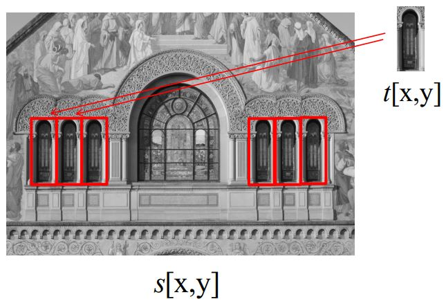
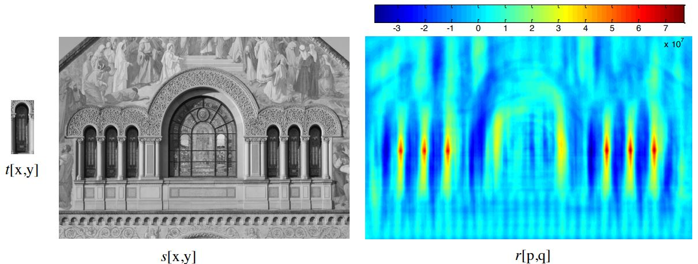
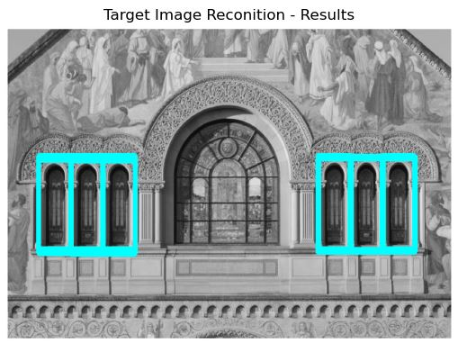
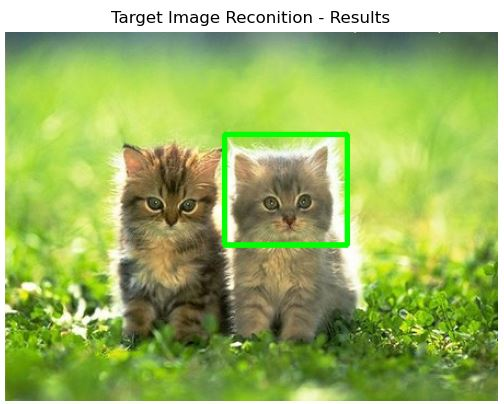
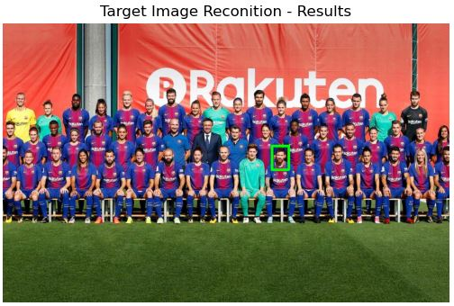

# Object-Recognition-Template-Matching--OpenCV-Python

## 1. Objective

To demonstrate object localization via template matching using OpenCV-Python built-in functionalities.

## 2. Code

|#                 | File name         |  Description 
|------------------|-------------------|--------------------|
|1                 | /code/Object-Recognition-Static-Template-Matching-OpenCV-Python.ipynb      |OpenCV-Python-API implementation of the functionalities for the object recognition from images using static template matching.  |
|1                 | /code/Object-Recognition-Adaptive-Template-Matching-OpenCV-Python.ipynb      |OpenCV-Python-API implementation of the functionalities for the object recognition from videos using adaptive template matching.  |


## 3. Template Matching

Most pixel-based object detection techniques are based on matching a known template within the target image. Thus, if a template describing a specific object is available, object detection becomes a process of matching features between the template and the image sequence under analysis. There are two types of object template matching, fixed and deformable template matching. Given that our objects of interest are rigid, we shall focus on fixed template matching.


### 3.1 Fixed Template Matching

Fixed templates are useful when object shapes do not change with respect to the viewing angle of the camera. Most fixed-template matching approach are based on computing the cross-correlation between the template and target images and detecting any peaks in the correlation values. In particular, these techniques apply a sliding window over all the pixels in order to detect the position of cross-similarity metric peak value between a template and a target image and locate the best match, if the template image is present in the target image. The absence of such a peak indicates that the template image is likely not in the target image. 

More specifically, the objective of template matching is to locate an object, described by a template T[x,y], in the image I[x,y]. 

<div class="row">
  <div class="column">
    
  </div>
</div>

The cross-similarity between the target image T and the reference image I can be assessed based in several suitable mtrics:

* Mean squared error with or without normalization
* Cross correlation with or without normalization

OpenCv offers the following 6 template matching modes:

```
Enumerations
enum  	cv::TemplateMatchModes {
  cv::TM_SQDIFF = 0,
  cv::TM_SQDIFF_NORMED = 1,
  cv::TM_CCORR = 2,
  cv::TM_CCORR_NORMED = 3,
  cv::TM_CCOEFF = 4,
  cv::TM_CCOEFF_NORMED = 5
}
 	type of the template matching operation More...
```

### 3.1.1 Exploring the Different Smiliarity Metrics

* TBD: 

  * Explore the differnt similarity metrics used for template matching
  * The normalized cross-correlation heat-map between the template and reference images illustrated in the fogure below. Note that higher cross-correlation sub-regions (windows) are associated with the correct location of the template image (window) in the reference image. 

<div class="row">
  <div class="column">
    
  </div>
</div>


### 3.1.2 Sample Results - Nomalized Cross-Correlation


<table>
  <tr>
    <td> Template </td>
    <td> Template Matching Results</td>
  </tr> 
  <tr>
    <td> Window </td>
    <td>  </td>
    <td> </td>
  </tr>
  <tr>
    <td> Right Kitten </td>
    <td>  </td>
    <td> </td>
  </tr>
  <tr>
    <td> Messi </td>
    <td>  </td>
    <td> </td>
  </tr>
</table>


### 3.1.3 Limitations

The limitations of pixel-based object detection approaches are very similar to those of pixel-based image stitching techniques. As such they tend to be computationally expensive as they process all image pixels, they are also sensitive to changes in illumination, scale and orientation. Furthermore, pixel-based template matching is sensitive to occlusion, as the object needs to be fully visible in the scene image to be detected. These techniques are more suitable for restricted environments where imaging conditions, such as image intensity and viewing angles between the template and images containing this template are the same. However, recently pixel-based template-matching techniques, which are less sensitive to variations in orientation, scale, translation, brightness and contrast have been proposed with some reported success.


### 3.2 Deformable Template Matching

* TBD: 

* Template matching from videoL
  * Adaptively update the template image
  * Try the video I found on Youtube

### 4 Conclusions

* TBD: 

